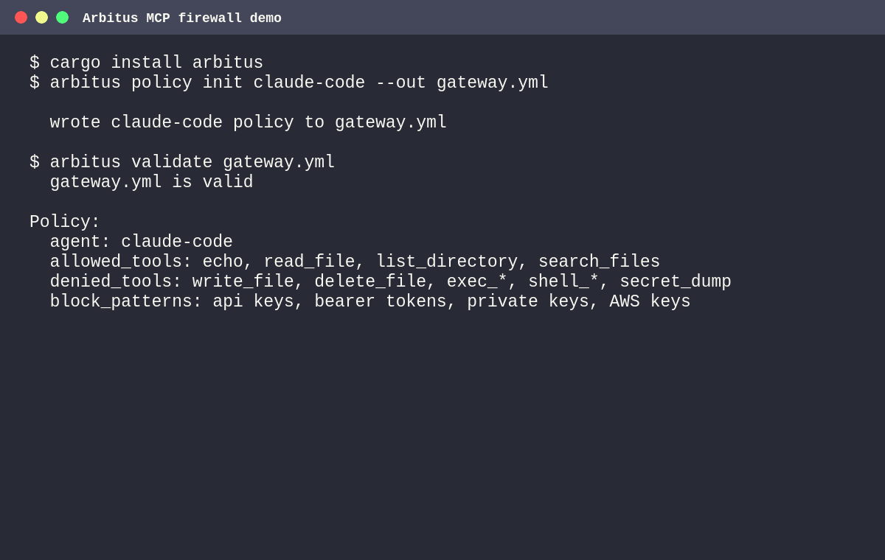

# Arbitus

[](https://crates.io/crates/arbitus)
[](LICENSE)
[](https://github.com/arbitusgateway/arbitus/actions/workflows/ci.yml)

Open-source firewall for MCP tool calls. Arbitus sits between AI agents and MCP servers, then blocks secret leaks, dangerous tools, runaway loops, and unapproved actions before requests reach upstream.

```
Agent (Claude Code, Cursor, OpenAI Agents SDK, etc.)
        │  JSON-RPC
        ▼
      arbitus     ← auth, rate limit, HITL, payload filter, audit
        │
        ▼
  MCP Server (filesystem, database, APIs...)
```

Use it when you want developers to keep using AI agents without giving every agent unrestricted access to your filesystem, databases, internal APIs, or production tools.



## Why teams use it

- **Stop secret exfiltration** — block or redact `.env` values, API keys, private keys, bearer tokens, and encoded variants before they leave the agent runtime
- **Constrain agent tools** — expose only approved tools through `tools/list`, then enforce the same policy on `tools/call`
- **Control blast radius** — rate-limit agents per minute, per tool, and per IP so loops do not become budget or infrastructure incidents
- **Approve risky actions** — require Human-in-the-Loop approval before writes, deletes, deploys, database mutations, or shell-like tools run
- **Keep an audit trail** — record every decision with request IDs and send events to SQLite, webhooks, CloudEvents, OpenLineage, Prometheus, or OTLP backends

## Threats Arbitus blocks

| Threat | Example | Arbitus control |
|--------|---------|-----------------|
| Secret exfiltration | An agent sends `.env`, API keys, bearer tokens, or private keys through `tools/call` arguments | Encoding-aware payload filtering with `block` or `redact` mode |
| Hidden dangerous tools | An agent guesses `delete_file`, `exec_shell`, or `drop_table` even if the tool was hidden from discovery | `tools/list` filtering plus enforced allowlists/denylists on `tools/call` |
| Prompt-injection payloads | Retrieved content tells the agent to ignore instructions or call another tool | Built-in prompt-injection patterns and response filtering |
| Runaway loops | A tool-calling loop burns budget or hammers an internal service | Per-agent, per-tool, and per-IP rate limits |
| Risky production actions | An agent tries to deploy, delete, mutate data, or run command-like tools | Human-in-the-Loop approval, shadow mode, and OPA/Rego policy checks |
| Unreviewable agent behavior | Security teams cannot reconstruct who called what and why it was allowed or blocked | Request IDs, audit logs, CloudEvents, OpenLineage, Prometheus, and OTLP traces |

## What it does

- **Auth** — per-agent allowlist/denylist with glob wildcards; API key, JWT/OIDC, or mTLS
- **tools/list filtering** — agents only see the tools they are allowed to call
- **Resource & Prompt access control** — `allowed_resources`/`denied_resources` and `allowed_prompts`/`denied_prompts` with list filtering; full MCP protocol governance
- **Default policy** — fallback policy for unknown agents; avoids hard-blocking agents not listed in config
- **Rate limiting** — per-agent sliding window + per-tool limits + per-IP limit; standard `X-RateLimit-*` headers
- **Human-in-the-Loop (HITL)** — suspend tool calls until an operator approves or rejects via REST API
- **Shadow mode** — intercept and log tool calls without forwarding; dry-run risky operations
- **Payload filtering** — block or redact sensitive patterns; encoding-aware (Base64, percent-encoding, Unicode)
- **Response filtering** — block upstream responses containing sensitive patterns
- **Schema validation** — validate `tools/call` arguments against `inputSchema` from `tools/list`
- **OPA/Rego policy engine** — evaluate every `tools/call` against a Rego policy file; input exposes agent, tool, arguments, and client IP
- **Supply-chain security** — verify MCP server binaries via SHA-256 or cosign before spawning (stdio mode)
- **Audit log** — every request recorded with `X-Request-Id`; fan-out to SQLite, webhook, stdout, or OpenLineage
- **CloudEvents** — webhook audit can emit CNCF CloudEvents 1.0 for direct SIEM ingestion
- **Tool Federation** — aggregate tools from multiple upstreams into a single view
- **OpenAI Tools Bridge** — `/openai/v1/tools` and `/openai/v1/execute` for OpenAI function-calling clients
- **Multiple upstreams** — route different agents to different MCP servers
- **Circuit breaker** — automatic upstream failure isolation with half-open recovery
- **Config hot-reload** — reload on `SIGUSR1`, automatically every 30 seconds, or event-driven via Kubernetes ConfigMap watcher
- **Lock-free rate limiting** — GCRA algorithm via `governor`; O(1) per check, configurable burst allowance
- **Metrics** — Prometheus-compatible `/metrics` endpoint with cost/token estimation
- **OpenTelemetry** — export traces to any OTLP backend (Jaeger, Tempo, Honeycomb, Datadog)
- **Dashboard** — `/dashboard` audit viewer with per-agent filtering
- **TLS / mTLS** — optional HTTPS with mutual TLS agent authentication
- **Transport agnostic** — HTTP+SSE or stdio; same config, same policies
- **Secrets-safe config** — `${VAR}` interpolation in YAML + `ARBITUS_*` env var overrides; compatible with K8s Secrets, Vault, External Secrets Operator
- **Container-ready** — multi-arch Docker image, Helm chart with sidecar pattern, graceful shutdown

## Documentation

| Document | Contents |
|----------|----------|
| **[Configuration](docs/configuration.md)** | Full YAML reference — transport, auth (JWT/OIDC), agents, rules, secrets, upstreams, default policy, OPA, schema validation |
| **[Usage](docs/usage.md)** | HTTP mode, sessions, rate-limit headers, HITL approvals, shadow mode, supply-chain verification, SSE streaming, OpenAI bridge, tool federation |
| **[Deployment](docs/deployment.md)** | Docker, Helm chart (sidecar pattern, values reference), HTTPS, mTLS, stdio mode, graceful shutdown |
| **[Audit](docs/audit.md)** | Audit backends (SQLite, webhook, stdout), CloudEvents 1.0, OpenLineage, audit CLI |
| **[Observability](docs/observability.md)** | Prometheus metrics, cost/token estimation, health check, dashboard, config hot-reload, OpenTelemetry, logging, circuit breaker |
| **[Architecture](docs/architecture.md)** | Middleware pipeline, trait-based design, encoding-aware filtering, test structure |
| **[Threat model](docs/threat-model.md)** | Assets, trust boundaries, mitigated threats, residual risks, hardening checklist |
| **[Security demo](docs/security-demo.md)** | Copy/paste walkthrough that blocks a fake `.env` exfiltration attempt |
| **[Demo script](demo/README.md)** | Reproducible terminal demo for recording and launch assets |
| **[Claude Code](docs/claude-code.md)** | Connect Claude Code to MCP servers through Arbitus |
| **[Cursor](docs/cursor.md)** | Configure Cursor MCP access through Arbitus |
| **[OpenAI Agents SDK](docs/openai-agents.md)** | Use `MCPServerStreamableHttp` with Arbitus as the policy gateway |

## Starter policies

The `examples/policies/` directory contains ready-to-copy configs for common agent setups:

| Policy | Use case |
|--------|----------|
| **[claude-code-readonly.yml](examples/policies/claude-code-readonly.yml)** | Claude Code can inspect files and search, but cannot write, delete, execute, or dump secrets |
| **[cursor-dev.yml](examples/policies/cursor-dev.yml)** | Cursor gets normal dev tools with HITL approval for writes and shadow mode for command execution |
| **[openai-agents-safe.yml](examples/policies/openai-agents-safe.yml)** | OpenAI Agents SDK clients get read-oriented MCP access with strict rate limits and secret filtering |

## Community

- **[Contributing](CONTRIBUTING.md)** — How to contribute, development setup, code quality requirements
- **[Code of Conduct](CODE_OF_CONDUCT.md)** — Standards for community behavior
- **[Security Policy](SECURITY.md)** — Reporting vulnerabilities, supported versions, security features
- **[Governance](GOVERNANCE.md)** — Project roles, decision-making, becoming a maintainer

## Quick start

### Install

```sh
cargo install arbitus
```

Or download a pre-built binary from the [releases page](https://github.com/arbitusgateway/arbitus/releases):

| Platform | Archive |
|---|---|
| Linux x64 (static) | `arbitus-vX.Y.Z-x86_64-unknown-linux-musl.tar.gz` |
| Linux ARM64 (static) | `arbitus-vX.Y.Z-aarch64-unknown-linux-musl.tar.gz` |
| macOS x64 | `arbitus-vX.Y.Z-x86_64-apple-darwin.tar.gz` |
| macOS Apple Silicon | `arbitus-vX.Y.Z-aarch64-apple-darwin.tar.gz` |
| Windows x64 | `arbitus-vX.Y.Z-x86_64-pc-windows-msvc.zip` |

Or build from source:

```sh
git clone https://github.com/arbitusgateway/arbitus
cd arbitus
cargo build --release
```

Or use Docker:

```sh
docker pull ghcr.io/arbitusgateway/arbitus:latest
docker run --rm -p 4000:4000 -v $(pwd)/gateway.yml:/app/gateway.yml ghcr.io/arbitusgateway/arbitus:latest
```

### Configure

```sh
cp gateway.example.yml gateway.yml
```

```yaml
transport:
  type: http
  addr: "0.0.0.0:4000"
  upstream: "http://localhost:3000/mcp"

agents:
  cursor:
    allowed_tools: [read_file, list_directory]
    rate_limit: 30

  claude-code:
    denied_tools: [write_file, delete_file]
    rate_limit: 60

rules:
  block_patterns: ["password", "api_key", "secret"]
```

Or start from a stricter policy:

```sh
arbitus policy init claude-code --out gateway.yml
```

List all bundled starter policies:

```sh
arbitus policy list
```

### Run

```sh
./arbitus gateway.yml
```

Agents connect to `http://localhost:4000/mcp`. The gateway enforces policies and forwards allowed requests to the upstream MCP server.

### Validate config

```sh
./arbitus validate gateway.yml
```

### Query audit log

```sh
./arbitus audit gateway-audit.db --agent cursor --outcome blocked --since 1h
```

## Architecture

```
            ┌──────────────────────────────────────────┐
            │                 Arbitus                  │
            │                                          │
  request ──► Pipeline                                 │
            │   1. RateLimitMiddleware                 │
            │   2. AuthMiddleware                      │
            │   3. HitlMiddleware    ← suspend & wait  │
            │   4. SchemaValidationMiddleware          │
            │   5. PayloadFilterMiddleware             │
            │         │                                │
            │    Allow / Block                         │
            │         │                                │
            │   Shadow mode check  ← mock if matched   │
            │         │                                │
            │   AuditLog + Metrics                     │
            │         │                                │
            │    McpUpstream (per-agent)               │
            └──────────────────────────────────────────┘
```

## Tests

```sh
cargo test --all-features              # All tests
cargo test --lib                       # Unit tests only (no stdio/npx)
cargo test --test http_gateway         # Single integration test file
```

## License

[MIT](LICENSE)
